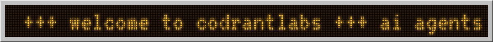
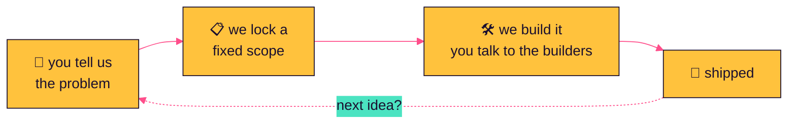
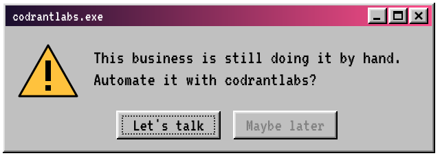

<!-- hi, view-source person 👀 you get it. -->
<div align="center">




<br/>

<sub>🖱️ double-click an icon (a single click works too, it's 2026)</sub>

<a href="#the-jukebox"></a>
<a href="#how-it-works"></a>
<a href="#the-crew"></a>
<a href="#guestbook"></a>
<a href="#secret-files"></a>
<a href="mailto:hello@YOUR-SITE.com"></a>

<br/><br/>

**codrantlabs** is a founder-led product and AI engineering studio from Kerala.<br/>
We build for service businesses, startups and enterprise teams that need software shipped.

<!-- TODO: replace with your real links -->
<a href="https://YOUR-SITE.com"></a>
<a href="mailto:hello@YOUR-SITE.com"></a>
<a href="https://www.linkedin.com/company/YOUR-PAGE"></a>

</div>

<br/>

### the jukebox



<details>
<summary><b>💿 read the liner notes</b> <sub>(click me)</sub></summary>
<br/>

| track | what it actually is |
|:--|:--|
| **01** ai agents | Agents that handle multi-step work inside the tools you already use. |
| **02** rag systems | Search and answers grounded in your own documents and data. |
| **03** full-stack web | Web platforms and websites, from first screen to deployment. |
| **04** seo + geo | Getting found on search engines, and showing up in AI answers. |
| **05** whatsapp + voice | Automated customer conversations on WhatsApp and over voice. |

</details>

<br/>

### how it works



<div align="center">
<a href="mailto:hello@YOUR-SITE.com"></a>
<br/><sub>☝️ yes, the button works</sub>
</div>

<br/>

### the crew

<!-- TODO: add the other founders. Copy one <a> block and swap the GitHub username. -->
<a href="https://github.com/ADITHYASNAIR2021"></a>
<!--
<a href="https://github.com/USERNAME"></a>
<a href="https://github.com/USERNAME"></a>
<a href="https://github.com/USERNAME"></a>
-->

<br/>

### guestbook



<!-- GUESTBOOK:START -->

| visitor | message | signed |
|:--|:--|:--|
| 📝 | nobody yet. be the first one on the wall 👇 | today |

<!-- GUESTBOOK:END -->

<div align="center">
<a href="https://github.com/YOUR-ORG/.github/issues/new?title=guestbook&body=Write+your+message+below+%28one+line%2C+no+links%29%3A%0A%0A"></a>
<br/><sub>opens a GitHub issue. hit submit and a bot adds you to the wall in about a minute.</sub>
</div>

<br/>

### secret files

<details>
<summary><b>💾 load floppy.stl</b> <sub>(it's real 3D. drag it, spin it, zoom it)</sub></summary>

```stl
solid floppy
facet normal 0 0 -1
outer loop
vertex 0 0 0
vertex 90 94 0
vertex 90 0 0
endloop
endfacet
facet normal 0 0 -1
outer loop
vertex 0 0 0
vertex 0 94 0
vertex 90 94 0
endloop
endfacet
facet normal 0 0 1
outer loop
vertex 0 0 3.3
vertex 90 0 3.3
vertex 90 94 3.3
endloop
endfacet
facet normal 0 0 1
outer loop
vertex 0 0 3.3
vertex 90 94 3.3
vertex 0 94 3.3
endloop
endfacet
facet normal 0 -1 0
outer loop
vertex 0 0 0
vertex 90 0 0
vertex 90 0 3.3
endloop
endfacet
facet normal 0 -1 0
outer loop
vertex 0 0 0
vertex 90 0 3.3
vertex 0 0 3.3
endloop
endfacet
facet normal 0 1 0
outer loop
vertex 0 94 0
vertex 0 94 3.3
vertex 90 94 3.3
endloop
endfacet
facet normal 0 1 0
outer loop
vertex 0 94 0
vertex 90 94 3.3
vertex 90 94 0
endloop
endfacet
facet normal -1 0 0
outer loop
vertex 0 0 0
vertex 0 0 3.3
vertex 0 94 3.3
endloop
endfacet
facet normal -1 0 0
outer loop
vertex 0 0 0
vertex 0 94 3.3
vertex 0 94 0
endloop
endfacet
facet normal 1 0 0
outer loop
vertex 90 0 0
vertex 90 94 0
vertex 90 94 3.3
endloop
endfacet
facet normal 1 0 0
outer loop
vertex 90 0 0
vertex 90 94 3.3
vertex 90 0 3.3
endloop
endfacet
facet normal 0 0 -1
outer loop
vertex 20 62 3.3
vertex 70 94 3.3
vertex 70 62 3.3
endloop
endfacet
facet normal 0 0 -1
outer loop
vertex 20 62 3.3
vertex 20 94 3.3
vertex 70 94 3.3
endloop
endfacet
facet normal 0 0 1
outer loop
vertex 20 62 3.8
vertex 70 62 3.8
vertex 70 94 3.8
endloop
endfacet
facet normal 0 0 1
outer loop
vertex 20 62 3.8
vertex 70 94 3.8
vertex 20 94 3.8
endloop
endfacet
facet normal 0 -1 0
outer loop
vertex 20 62 3.3
vertex 70 62 3.3
vertex 70 62 3.8
endloop
endfacet
facet normal 0 -1 0
outer loop
vertex 20 62 3.3
vertex 70 62 3.8
vertex 20 62 3.8
endloop
endfacet
facet normal 0 1 0
outer loop
vertex 20 94 3.3
vertex 20 94 3.8
vertex 70 94 3.8
endloop
endfacet
facet normal 0 1 0
outer loop
vertex 20 94 3.3
vertex 70 94 3.8
vertex 70 94 3.3
endloop
endfacet
facet normal -1 0 0
outer loop
vertex 20 62 3.3
vertex 20 62 3.8
vertex 20 94 3.8
endloop
endfacet
facet normal -1 0 0
outer loop
vertex 20 62 3.3
vertex 20 94 3.8
vertex 20 94 3.3
endloop
endfacet
facet normal 1 0 0
outer loop
vertex 70 62 3.3
vertex 70 94 3.3
vertex 70 94 3.8
endloop
endfacet
facet normal 1 0 0
outer loop
vertex 70 62 3.3
vertex 70 94 3.8
vertex 70 62 3.8
endloop
endfacet
facet normal 0 0 -1
outer loop
vertex 44 70 3.8
vertex 56 90 3.8
vertex 56 70 3.8
endloop
endfacet
facet normal 0 0 -1
outer loop
vertex 44 70 3.8
vertex 44 90 3.8
vertex 56 90 3.8
endloop
endfacet
facet normal 0 0 1
outer loop
vertex 44 70 4
vertex 56 70 4
vertex 56 90 4
endloop
endfacet
facet normal 0 0 1
outer loop
vertex 44 70 4
vertex 56 90 4
vertex 44 90 4
endloop
endfacet
facet normal 0 -1 0
outer loop
vertex 44 70 3.8
vertex 56 70 3.8
vertex 56 70 4
endloop
endfacet
facet normal 0 -1 0
outer loop
vertex 44 70 3.8
vertex 56 70 4
vertex 44 70 4
endloop
endfacet
facet normal 0 1 0
outer loop
vertex 44 90 3.8
vertex 44 90 4
vertex 56 90 4
endloop
endfacet
facet normal 0 1 0
outer loop
vertex 44 90 3.8
vertex 56 90 4
vertex 56 90 3.8
endloop
endfacet
facet normal -1 0 0
outer loop
vertex 44 70 3.8
vertex 44 70 4
vertex 44 90 4
endloop
endfacet
facet normal -1 0 0
outer loop
vertex 44 70 3.8
vertex 44 90 4
vertex 44 90 3.8
endloop
endfacet
facet normal 1 0 0
outer loop
vertex 56 70 3.8
vertex 56 90 3.8
vertex 56 90 4
endloop
endfacet
facet normal 1 0 0
outer loop
vertex 56 70 3.8
vertex 56 90 4
vertex 56 70 4
endloop
endfacet
facet normal 0 0 -1
outer loop
vertex 8 4 3.3
vertex 82 54 3.3
vertex 82 4 3.3
endloop
endfacet
facet normal 0 0 -1
outer loop
vertex 8 4 3.3
vertex 8 54 3.3
vertex 82 54 3.3
endloop
endfacet
facet normal 0 0 1
outer loop
vertex 8 4 3.6
vertex 82 4 3.6
vertex 82 54 3.6
endloop
endfacet
facet normal 0 0 1
outer loop
vertex 8 4 3.6
vertex 82 54 3.6
vertex 8 54 3.6
endloop
endfacet
facet normal 0 -1 0
outer loop
vertex 8 4 3.3
vertex 82 4 3.3
vertex 82 4 3.6
endloop
endfacet
facet normal 0 -1 0
outer loop
vertex 8 4 3.3
vertex 82 4 3.6
vertex 8 4 3.6
endloop
endfacet
facet normal 0 1 0
outer loop
vertex 8 54 3.3
vertex 8 54 3.6
vertex 82 54 3.6
endloop
endfacet
facet normal 0 1 0
outer loop
vertex 8 54 3.3
vertex 82 54 3.6
vertex 82 54 3.3
endloop
endfacet
facet normal -1 0 0
outer loop
vertex 8 4 3.3
vertex 8 4 3.6
vertex 8 54 3.6
endloop
endfacet
facet normal -1 0 0
outer loop
vertex 8 4 3.3
vertex 8 54 3.6
vertex 8 54 3.3
endloop
endfacet
facet normal 1 0 0
outer loop
vertex 82 4 3.3
vertex 82 54 3.3
vertex 82 54 3.6
endloop
endfacet
facet normal 1 0 0
outer loop
vertex 82 4 3.3
vertex 82 54 3.6
vertex 82 4 3.6
endloop
endfacet
facet normal 0 0 -1
outer loop
vertex 3 84 3.3
vertex 9 91 3.3
vertex 9 84 3.3
endloop
endfacet
facet normal 0 0 -1
outer loop
vertex 3 84 3.3
vertex 3 91 3.3
vertex 9 91 3.3
endloop
endfacet
facet normal 0 0 1
outer loop
vertex 3 84 3.7
vertex 9 84 3.7
vertex 9 91 3.7
endloop
endfacet
facet normal 0 0 1
outer loop
vertex 3 84 3.7
vertex 9 91 3.7
vertex 3 91 3.7
endloop
endfacet
facet normal 0 -1 0
outer loop
vertex 3 84 3.3
vertex 9 84 3.3
vertex 9 84 3.7
endloop
endfacet
facet normal 0 -1 0
outer loop
vertex 3 84 3.3
vertex 9 84 3.7
vertex 3 84 3.7
endloop
endfacet
facet normal 0 1 0
outer loop
vertex 3 91 3.3
vertex 3 91 3.7
vertex 9 91 3.7
endloop
endfacet
facet normal 0 1 0
outer loop
vertex 3 91 3.3
vertex 9 91 3.7
vertex 9 91 3.3
endloop
endfacet
facet normal -1 0 0
outer loop
vertex 3 84 3.3
vertex 3 84 3.7
vertex 3 91 3.7
endloop
endfacet
facet normal -1 0 0
outer loop
vertex 3 84 3.3
vertex 3 91 3.7
vertex 3 91 3.3
endloop
endfacet
facet normal 1 0 0
outer loop
vertex 9 84 3.3
vertex 9 91 3.3
vertex 9 91 3.7
endloop
endfacet
facet normal 1 0 0
outer loop
vertex 9 84 3.3
vertex 9 91 3.7
vertex 9 84 3.7
endloop
endfacet
facet normal 0 0 -1
outer loop
vertex 28.2 43.8 3.6
vertex 40.8 48 3.6
vertex 40.8 43.8 3.6
endloop
endfacet
facet normal 0 0 -1
outer loop
vertex 28.2 43.8 3.6
vertex 28.2 48 3.6
vertex 40.8 48 3.6
endloop
endfacet
facet normal 0 0 1
outer loop
vertex 28.2 43.8 5
vertex 40.8 43.8 5
vertex 40.8 48 5
endloop
endfacet
facet normal 0 0 1
outer loop
vertex 28.2 43.8 5
vertex 40.8 48 5
vertex 28.2 48 5
endloop
endfacet
facet normal 0 -1 0
outer loop
vertex 28.2 43.8 3.6
vertex 40.8 43.8 3.6
vertex 40.8 43.8 5
endloop
endfacet
facet normal 0 -1 0
outer loop
vertex 28.2 43.8 3.6
vertex 40.8 43.8 5
vertex 28.2 43.8 5
endloop
endfacet
facet normal 0 1 0
outer loop
vertex 28.2 48 3.6
vertex 28.2 48 5
vertex 40.8 48 5
endloop
endfacet
facet normal 0 1 0
outer loop
vertex 28.2 48 3.6
vertex 40.8 48 5
vertex 40.8 48 3.6
endloop
endfacet
facet normal -1 0 0
outer loop
vertex 28.2 43.8 3.6
vertex 28.2 43.8 5
vertex 28.2 48 5
endloop
endfacet
facet normal -1 0 0
outer loop
vertex 28.2 43.8 3.6
vertex 28.2 48 5
vertex 28.2 48 3.6
endloop
endfacet
facet normal 1 0 0
outer loop
vertex 40.8 43.8 3.6
vertex 40.8 48 3.6
vertex 40.8 48 5
endloop
endfacet
facet normal 1 0 0
outer loop
vertex 40.8 43.8 3.6
vertex 40.8 48 5
vertex 40.8 43.8 5
endloop
endfacet
facet normal 0 0 -1
outer loop
vertex 24 39.6 3.6
vertex 28.2 43.8 3.6
vertex 28.2 39.6 3.6
endloop
endfacet
facet normal 0 0 -1
outer loop
vertex 24 39.6 3.6
vertex 24 43.8 3.6
vertex 28.2 43.8 3.6
endloop
endfacet
facet normal 0 0 1
outer loop
vertex 24 39.6 5
vertex 28.2 39.6 5
vertex 28.2 43.8 5
endloop
endfacet
facet normal 0 0 1
outer loop
vertex 24 39.6 5
vertex 28.2 43.8 5
vertex 24 43.8 5
endloop
endfacet
facet normal 0 -1 0
outer loop
vertex 24 39.6 3.6
vertex 28.2 39.6 3.6
vertex 28.2 39.6 5
endloop
endfacet
facet normal 0 -1 0
outer loop
vertex 24 39.6 3.6
vertex 28.2 39.6 5
vertex 24 39.6 5
endloop
endfacet
facet normal 0 1 0
outer loop
vertex 24 43.8 3.6
vertex 24 43.8 5
vertex 28.2 43.8 5
endloop
endfacet
facet normal 0 1 0
outer loop
vertex 24 43.8 3.6
vertex 28.2 43.8 5
vertex 28.2 43.8 3.6
endloop
endfacet
facet normal -1 0 0
outer loop
vertex 24 39.6 3.6
vertex 24 39.6 5
vertex 24 43.8 5
endloop
endfacet
facet normal -1 0 0
outer loop
vertex 24 39.6 3.6
vertex 24 43.8 5
vertex 24 43.8 3.6
endloop
endfacet
facet normal 1 0 0
outer loop
vertex 28.2 39.6 3.6
vertex 28.2 43.8 3.6
vertex 28.2 43.8 5
endloop
endfacet
facet normal 1 0 0
outer loop
vertex 28.2 39.6 3.6
vertex 28.2 43.8 5
vertex 28.2 39.6 5
endloop
endfacet
facet normal 0 0 -1
outer loop
vertex 40.8 39.6 3.6
vertex 45 43.8 3.6
vertex 45 39.6 3.6
endloop
endfacet
facet normal 0 0 -1
outer loop
vertex 40.8 39.6 3.6
vertex 40.8 43.8 3.6
vertex 45 43.8 3.6
endloop
endfacet
facet normal 0 0 1
outer loop
vertex 40.8 39.6 5
vertex 45 39.6 5
vertex 45 43.8 5
endloop
endfacet
facet normal 0 0 1
outer loop
vertex 40.8 39.6 5
vertex 45 43.8 5
vertex 40.8 43.8 5
endloop
endfacet
facet normal 0 -1 0
outer loop
vertex 40.8 39.6 3.6
vertex 45 39.6 3.6
vertex 45 39.6 5
endloop
endfacet
facet normal 0 -1 0
outer loop
vertex 40.8 39.6 3.6
vertex 45 39.6 5
vertex 40.8 39.6 5
endloop
endfacet
facet normal 0 1 0
outer loop
vertex 40.8 43.8 3.6
vertex 40.8 43.8 5
vertex 45 43.8 5
endloop
endfacet
facet normal 0 1 0
outer loop
vertex 40.8 43.8 3.6
vertex 45 43.8 5
vertex 45 43.8 3.6
endloop
endfacet
facet normal -1 0 0
outer loop
vertex 40.8 39.6 3.6
vertex 40.8 39.6 5
vertex 40.8 43.8 5
endloop
endfacet
facet normal -1 0 0
outer loop
vertex 40.8 39.6 3.6
vertex 40.8 43.8 5
vertex 40.8 43.8 3.6
endloop
endfacet
facet normal 1 0 0
outer loop
vertex 45 39.6 3.6
vertex 45 43.8 3.6
vertex 45 43.8 5
endloop
endfacet
facet normal 1 0 0
outer loop
vertex 45 39.6 3.6
vertex 45 43.8 5
vertex 45 39.6 5
endloop
endfacet
facet normal 0 0 -1
outer loop
vertex 24 35.4 3.6
vertex 28.2 39.6 3.6
vertex 28.2 35.4 3.6
endloop
endfacet
facet normal 0 0 -1
outer loop
vertex 24 35.4 3.6
vertex 24 39.6 3.6
vertex 28.2 39.6 3.6
endloop
endfacet
facet normal 0 0 1
outer loop
vertex 24 35.4 5
vertex 28.2 35.4 5
vertex 28.2 39.6 5
endloop
endfacet
facet normal 0 0 1
outer loop
vertex 24 35.4 5
vertex 28.2 39.6 5
vertex 24 39.6 5
endloop
endfacet
facet normal 0 -1 0
outer loop
vertex 24 35.4 3.6
vertex 28.2 35.4 3.6
vertex 28.2 35.4 5
endloop
endfacet
facet normal 0 -1 0
outer loop
vertex 24 35.4 3.6
vertex 28.2 35.4 5
vertex 24 35.4 5
endloop
endfacet
facet normal 0 1 0
outer loop
vertex 24 39.6 3.6
vertex 24 39.6 5
vertex 28.2 39.6 5
endloop
endfacet
facet normal 0 1 0
outer loop
vertex 24 39.6 3.6
vertex 28.2 39.6 5
vertex 28.2 39.6 3.6
endloop
endfacet
facet normal -1 0 0
outer loop
vertex 24 35.4 3.6
vertex 24 35.4 5
vertex 24 39.6 5
endloop
endfacet
facet normal -1 0 0
outer loop
vertex 24 35.4 3.6
vertex 24 39.6 5
vertex 24 39.6 3.6
endloop
endfacet
facet normal 1 0 0
outer loop
vertex 28.2 35.4 3.6
vertex 28.2 39.6 3.6
vertex 28.2 39.6 5
endloop
endfacet
facet normal 1 0 0
outer loop
vertex 28.2 35.4 3.6
vertex 28.2 39.6 5
vertex 28.2 35.4 5
endloop
endfacet
facet normal 0 0 -1
outer loop
vertex 24 31.2 3.6
vertex 28.2 35.4 3.6
vertex 28.2 31.2 3.6
endloop
endfacet
facet normal 0 0 -1
outer loop
vertex 24 31.2 3.6
vertex 24 35.4 3.6
vertex 28.2 35.4 3.6
endloop
endfacet
facet normal 0 0 1
outer loop
vertex 24 31.2 5
vertex 28.2 31.2 5
vertex 28.2 35.4 5
endloop
endfacet
facet normal 0 0 1
outer loop
vertex 24 31.2 5
vertex 28.2 35.4 5
vertex 24 35.4 5
endloop
endfacet
facet normal 0 -1 0
outer loop
vertex 24 31.2 3.6
vertex 28.2 31.2 3.6
vertex 28.2 31.2 5
endloop
endfacet
facet normal 0 -1 0
outer loop
vertex 24 31.2 3.6
vertex 28.2 31.2 5
vertex 24 31.2 5
endloop
endfacet
facet normal 0 1 0
outer loop
vertex 24 35.4 3.6
vertex 24 35.4 5
vertex 28.2 35.4 5
endloop
endfacet
facet normal 0 1 0
outer loop
vertex 24 35.4 3.6
vertex 28.2 35.4 5
vertex 28.2 35.4 3.6
endloop
endfacet
facet normal -1 0 0
outer loop
vertex 24 31.2 3.6
vertex 24 31.2 5
vertex 24 35.4 5
endloop
endfacet
facet normal -1 0 0
outer loop
vertex 24 31.2 3.6
vertex 24 35.4 5
vertex 24 35.4 3.6
endloop
endfacet
facet normal 1 0 0
outer loop
vertex 28.2 31.2 3.6
vertex 28.2 35.4 3.6
vertex 28.2 35.4 5
endloop
endfacet
facet normal 1 0 0
outer loop
vertex 28.2 31.2 3.6
vertex 28.2 35.4 5
vertex 28.2 31.2 5
endloop
endfacet
facet normal 0 0 -1
outer loop
vertex 24 27 3.6
vertex 28.2 31.2 3.6
vertex 28.2 27 3.6
endloop
endfacet
facet normal 0 0 -1
outer loop
vertex 24 27 3.6
vertex 24 31.2 3.6
vertex 28.2 31.2 3.6
endloop
endfacet
facet normal 0 0 1
outer loop
vertex 24 27 5
vertex 28.2 27 5
vertex 28.2 31.2 5
endloop
endfacet
facet normal 0 0 1
outer loop
vertex 24 27 5
vertex 28.2 31.2 5
vertex 24 31.2 5
endloop
endfacet
facet normal 0 -1 0
outer loop
vertex 24 27 3.6
vertex 28.2 27 3.6
vertex 28.2 27 5
endloop
endfacet
facet normal 0 -1 0
outer loop
vertex 24 27 3.6
vertex 28.2 27 5
vertex 24 27 5
endloop
endfacet
facet normal 0 1 0
outer loop
vertex 24 31.2 3.6
vertex 24 31.2 5
vertex 28.2 31.2 5
endloop
endfacet
facet normal 0 1 0
outer loop
vertex 24 31.2 3.6
vertex 28.2 31.2 5
vertex 28.2 31.2 3.6
endloop
endfacet
facet normal -1 0 0
outer loop
vertex 24 27 3.6
vertex 24 27 5
vertex 24 31.2 5
endloop
endfacet
facet normal -1 0 0
outer loop
vertex 24 27 3.6
vertex 24 31.2 5
vertex 24 31.2 3.6
endloop
endfacet
facet normal 1 0 0
outer loop
vertex 28.2 27 3.6
vertex 28.2 31.2 3.6
vertex 28.2 31.2 5
endloop
endfacet
facet normal 1 0 0
outer loop
vertex 28.2 27 3.6
vertex 28.2 31.2 5
vertex 28.2 27 5
endloop
endfacet
facet normal 0 0 -1
outer loop
vertex 24 22.8 3.6
vertex 28.2 27 3.6
vertex 28.2 22.8 3.6
endloop
endfacet
facet normal 0 0 -1
outer loop
vertex 24 22.8 3.6
vertex 24 27 3.6
vertex 28.2 27 3.6
endloop
endfacet
facet normal 0 0 1
outer loop
vertex 24 22.8 5
vertex 28.2 22.8 5
vertex 28.2 27 5
endloop
endfacet
facet normal 0 0 1
outer loop
vertex 24 22.8 5
vertex 28.2 27 5
vertex 24 27 5
endloop
endfacet
facet normal 0 -1 0
outer loop
vertex 24 22.8 3.6
vertex 28.2 22.8 3.6
vertex 28.2 22.8 5
endloop
endfacet
facet normal 0 -1 0
outer loop
vertex 24 22.8 3.6
vertex 28.2 22.8 5
vertex 24 22.8 5
endloop
endfacet
facet normal 0 1 0
outer loop
vertex 24 27 3.6
vertex 24 27 5
vertex 28.2 27 5
endloop
endfacet
facet normal 0 1 0
outer loop
vertex 24 27 3.6
vertex 28.2 27 5
vertex 28.2 27 3.6
endloop
endfacet
facet normal -1 0 0
outer loop
vertex 24 22.8 3.6
vertex 24 22.8 5
vertex 24 27 5
endloop
endfacet
facet normal -1 0 0
outer loop
vertex 24 22.8 3.6
vertex 24 27 5
vertex 24 27 3.6
endloop
endfacet
facet normal 1 0 0
outer loop
vertex 28.2 22.8 3.6
vertex 28.2 27 3.6
vertex 28.2 27 5
endloop
endfacet
facet normal 1 0 0
outer loop
vertex 28.2 22.8 3.6
vertex 28.2 27 5
vertex 28.2 22.8 5
endloop
endfacet
facet normal 0 0 -1
outer loop
vertex 40.8 22.8 3.6
vertex 45 27 3.6
vertex 45 22.8 3.6
endloop
endfacet
facet normal 0 0 -1
outer loop
vertex 40.8 22.8 3.6
vertex 40.8 27 3.6
vertex 45 27 3.6
endloop
endfacet
facet normal 0 0 1
outer loop
vertex 40.8 22.8 5
vertex 45 22.8 5
vertex 45 27 5
endloop
endfacet
facet normal 0 0 1
outer loop
vertex 40.8 22.8 5
vertex 45 27 5
vertex 40.8 27 5
endloop
endfacet
facet normal 0 -1 0
outer loop
vertex 40.8 22.8 3.6
vertex 45 22.8 3.6
vertex 45 22.8 5
endloop
endfacet
facet normal 0 -1 0
outer loop
vertex 40.8 22.8 3.6
vertex 45 22.8 5
vertex 40.8 22.8 5
endloop
endfacet
facet normal 0 1 0
outer loop
vertex 40.8 27 3.6
vertex 40.8 27 5
vertex 45 27 5
endloop
endfacet
facet normal 0 1 0
outer loop
vertex 40.8 27 3.6
vertex 45 27 5
vertex 45 27 3.6
endloop
endfacet
facet normal -1 0 0
outer loop
vertex 40.8 22.8 3.6
vertex 40.8 22.8 5
vertex 40.8 27 5
endloop
endfacet
facet normal -1 0 0
outer loop
vertex 40.8 22.8 3.6
vertex 40.8 27 5
vertex 40.8 27 3.6
endloop
endfacet
facet normal 1 0 0
outer loop
vertex 45 22.8 3.6
vertex 45 27 3.6
vertex 45 27 5
endloop
endfacet
facet normal 1 0 0
outer loop
vertex 45 22.8 3.6
vertex 45 27 5
vertex 45 22.8 5
endloop
endfacet
facet normal 0 0 -1
outer loop
vertex 28.2 18.6 3.6
vertex 40.8 22.8 3.6
vertex 40.8 18.6 3.6
endloop
endfacet
facet normal 0 0 -1
outer loop
vertex 28.2 18.6 3.6
vertex 28.2 22.8 3.6
vertex 40.8 22.8 3.6
endloop
endfacet
facet normal 0 0 1
outer loop
vertex 28.2 18.6 5
vertex 40.8 18.6 5
vertex 40.8 22.8 5
endloop
endfacet
facet normal 0 0 1
outer loop
vertex 28.2 18.6 5
vertex 40.8 22.8 5
vertex 28.2 22.8 5
endloop
endfacet
facet normal 0 -1 0
outer loop
vertex 28.2 18.6 3.6
vertex 40.8 18.6 3.6
vertex 40.8 18.6 5
endloop
endfacet
facet normal 0 -1 0
outer loop
vertex 28.2 18.6 3.6
vertex 40.8 18.6 5
vertex 28.2 18.6 5
endloop
endfacet
facet normal 0 1 0
outer loop
vertex 28.2 22.8 3.6
vertex 28.2 22.8 5
vertex 40.8 22.8 5
endloop
endfacet
facet normal 0 1 0
outer loop
vertex 28.2 22.8 3.6
vertex 40.8 22.8 5
vertex 40.8 22.8 3.6
endloop
endfacet
facet normal -1 0 0
outer loop
vertex 28.2 18.6 3.6
vertex 28.2 18.6 5
vertex 28.2 22.8 5
endloop
endfacet
facet normal -1 0 0
outer loop
vertex 28.2 18.6 3.6
vertex 28.2 22.8 5
vertex 28.2 22.8 3.6
endloop
endfacet
facet normal 1 0 0
outer loop
vertex 40.8 18.6 3.6
vertex 40.8 22.8 3.6
vertex 40.8 22.8 5
endloop
endfacet
facet normal 1 0 0
outer loop
vertex 40.8 18.6 3.6
vertex 40.8 22.8 5
vertex 40.8 18.6 5
endloop
endfacet
facet normal 0 0 -1
outer loop
vertex 50 43.8 3.6
vertex 54.2 48 3.6
vertex 54.2 43.8 3.6
endloop
endfacet
facet normal 0 0 -1
outer loop
vertex 50 43.8 3.6
vertex 50 48 3.6
vertex 54.2 48 3.6
endloop
endfacet
facet normal 0 0 1
outer loop
vertex 50 43.8 5
vertex 54.2 43.8 5
vertex 54.2 48 5
endloop
endfacet
facet normal 0 0 1
outer loop
vertex 50 43.8 5
vertex 54.2 48 5
vertex 50 48 5
endloop
endfacet
facet normal 0 -1 0
outer loop
vertex 50 43.8 3.6
vertex 54.2 43.8 3.6
vertex 54.2 43.8 5
endloop
endfacet
facet normal 0 -1 0
outer loop
vertex 50 43.8 3.6
vertex 54.2 43.8 5
vertex 50 43.8 5
endloop
endfacet
facet normal 0 1 0
outer loop
vertex 50 48 3.6
vertex 50 48 5
vertex 54.2 48 5
endloop
endfacet
facet normal 0 1 0
outer loop
vertex 50 48 3.6
vertex 54.2 48 5
vertex 54.2 48 3.6
endloop
endfacet
facet normal -1 0 0
outer loop
vertex 50 43.8 3.6
vertex 50 43.8 5
vertex 50 48 5
endloop
endfacet
facet normal -1 0 0
outer loop
vertex 50 43.8 3.6
vertex 50 48 5
vertex 50 48 3.6
endloop
endfacet
facet normal 1 0 0
outer loop
vertex 54.2 43.8 3.6
vertex 54.2 48 3.6
vertex 54.2 48 5
endloop
endfacet
facet normal 1 0 0
outer loop
vertex 54.2 43.8 3.6
vertex 54.2 48 5
vertex 54.2 43.8 5
endloop
endfacet
facet normal 0 0 -1
outer loop
vertex 50 39.6 3.6
vertex 54.2 43.8 3.6
vertex 54.2 39.6 3.6
endloop
endfacet
facet normal 0 0 -1
outer loop
vertex 50 39.6 3.6
vertex 50 43.8 3.6
vertex 54.2 43.8 3.6
endloop
endfacet
facet normal 0 0 1
outer loop
vertex 50 39.6 5
vertex 54.2 39.6 5
vertex 54.2 43.8 5
endloop
endfacet
facet normal 0 0 1
outer loop
vertex 50 39.6 5
vertex 54.2 43.8 5
vertex 50 43.8 5
endloop
endfacet
facet normal 0 -1 0
outer loop
vertex 50 39.6 3.6
vertex 54.2 39.6 3.6
vertex 54.2 39.6 5
endloop
endfacet
facet normal 0 -1 0
outer loop
vertex 50 39.6 3.6
vertex 54.2 39.6 5
vertex 50 39.6 5
endloop
endfacet
facet normal 0 1 0
outer loop
vertex 50 43.8 3.6
vertex 50 43.8 5
vertex 54.2 43.8 5
endloop
endfacet
facet normal 0 1 0
outer loop
vertex 50 43.8 3.6
vertex 54.2 43.8 5
vertex 54.2 43.8 3.6
endloop
endfacet
facet normal -1 0 0
outer loop
vertex 50 39.6 3.6
vertex 50 39.6 5
vertex 50 43.8 5
endloop
endfacet
facet normal -1 0 0
outer loop
vertex 50 39.6 3.6
vertex 50 43.8 5
vertex 50 43.8 3.6
endloop
endfacet
facet normal 1 0 0
outer loop
vertex 54.2 39.6 3.6
vertex 54.2 43.8 3.6
vertex 54.2 43.8 5
endloop
endfacet
facet normal 1 0 0
outer loop
vertex 54.2 39.6 3.6
vertex 54.2 43.8 5
vertex 54.2 39.6 5
endloop
endfacet
facet normal 0 0 -1
outer loop
vertex 50 35.4 3.6
vertex 54.2 39.6 3.6
vertex 54.2 35.4 3.6
endloop
endfacet
facet normal 0 0 -1
outer loop
vertex 50 35.4 3.6
vertex 50 39.6 3.6
vertex 54.2 39.6 3.6
endloop
endfacet
facet normal 0 0 1
outer loop
vertex 50 35.4 5
vertex 54.2 35.4 5
vertex 54.2 39.6 5
endloop
endfacet
facet normal 0 0 1
outer loop
vertex 50 35.4 5
vertex 54.2 39.6 5
vertex 50 39.6 5
endloop
endfacet
facet normal 0 -1 0
outer loop
vertex 50 35.4 3.6
vertex 54.2 35.4 3.6
vertex 54.2 35.4 5
endloop
endfacet
facet normal 0 -1 0
outer loop
vertex 50 35.4 3.6
vertex 54.2 35.4 5
vertex 50 35.4 5
endloop
endfacet
facet normal 0 1 0
outer loop
vertex 50 39.6 3.6
vertex 50 39.6 5
vertex 54.2 39.6 5
endloop
endfacet
facet normal 0 1 0
outer loop
vertex 50 39.6 3.6
vertex 54.2 39.6 5
vertex 54.2 39.6 3.6
endloop
endfacet
facet normal -1 0 0
outer loop
vertex 50 35.4 3.6
vertex 50 35.4 5
vertex 50 39.6 5
endloop
endfacet
facet normal -1 0 0
outer loop
vertex 50 35.4 3.6
vertex 50 39.6 5
vertex 50 39.6 3.6
endloop
endfacet
facet normal 1 0 0
outer loop
vertex 54.2 35.4 3.6
vertex 54.2 39.6 3.6
vertex 54.2 39.6 5
endloop
endfacet
facet normal 1 0 0
outer loop
vertex 54.2 35.4 3.6
vertex 54.2 39.6 5
vertex 54.2 35.4 5
endloop
endfacet
facet normal 0 0 -1
outer loop
vertex 50 31.2 3.6
vertex 54.2 35.4 3.6
vertex 54.2 31.2 3.6
endloop
endfacet
facet normal 0 0 -1
outer loop
vertex 50 31.2 3.6
vertex 50 35.4 3.6
vertex 54.2 35.4 3.6
endloop
endfacet
facet normal 0 0 1
outer loop
vertex 50 31.2 5
vertex 54.2 31.2 5
vertex 54.2 35.4 5
endloop
endfacet
facet normal 0 0 1
outer loop
vertex 50 31.2 5
vertex 54.2 35.4 5
vertex 50 35.4 5
endloop
endfacet
facet normal 0 -1 0
outer loop
vertex 50 31.2 3.6
vertex 54.2 31.2 3.6
vertex 54.2 31.2 5
endloop
endfacet
facet normal 0 -1 0
outer loop
vertex 50 31.2 3.6
vertex 54.2 31.2 5
vertex 50 31.2 5
endloop
endfacet
facet normal 0 1 0
outer loop
vertex 50 35.4 3.6
vertex 50 35.4 5
vertex 54.2 35.4 5
endloop
endfacet
facet normal 0 1 0
outer loop
vertex 50 35.4 3.6
vertex 54.2 35.4 5
vertex 54.2 35.4 3.6
endloop
endfacet
facet normal -1 0 0
outer loop
vertex 50 31.2 3.6
vertex 50 31.2 5
vertex 50 35.4 5
endloop
endfacet
facet normal -1 0 0
outer loop
vertex 50 31.2 3.6
vertex 50 35.4 5
vertex 50 35.4 3.6
endloop
endfacet
facet normal 1 0 0
outer loop
vertex 54.2 31.2 3.6
vertex 54.2 35.4 3.6
vertex 54.2 35.4 5
endloop
endfacet
facet normal 1 0 0
outer loop
vertex 54.2 31.2 3.6
vertex 54.2 35.4 5
vertex 54.2 31.2 5
endloop
endfacet
facet normal 0 0 -1
outer loop
vertex 50 27 3.6
vertex 54.2 31.2 3.6
vertex 54.2 27 3.6
endloop
endfacet
facet normal 0 0 -1
outer loop
vertex 50 27 3.6
vertex 50 31.2 3.6
vertex 54.2 31.2 3.6
endloop
endfacet
facet normal 0 0 1
outer loop
vertex 50 27 5
vertex 54.2 27 5
vertex 54.2 31.2 5
endloop
endfacet
facet normal 0 0 1
outer loop
vertex 50 27 5
vertex 54.2 31.2 5
vertex 50 31.2 5
endloop
endfacet
facet normal 0 -1 0
outer loop
vertex 50 27 3.6
vertex 54.2 27 3.6
vertex 54.2 27 5
endloop
endfacet
facet normal 0 -1 0
outer loop
vertex 50 27 3.6
vertex 54.2 27 5
vertex 50 27 5
endloop
endfacet
facet normal 0 1 0
outer loop
vertex 50 31.2 3.6
vertex 50 31.2 5
vertex 54.2 31.2 5
endloop
endfacet
facet normal 0 1 0
outer loop
vertex 50 31.2 3.6
vertex 54.2 31.2 5
vertex 54.2 31.2 3.6
endloop
endfacet
facet normal -1 0 0
outer loop
vertex 50 27 3.6
vertex 50 27 5
vertex 50 31.2 5
endloop
endfacet
facet normal -1 0 0
outer loop
vertex 50 27 3.6
vertex 50 31.2 5
vertex 50 31.2 3.6
endloop
endfacet
facet normal 1 0 0
outer loop
vertex 54.2 27 3.6
vertex 54.2 31.2 3.6
vertex 54.2 31.2 5
endloop
endfacet
facet normal 1 0 0
outer loop
vertex 54.2 27 3.6
vertex 54.2 31.2 5
vertex 54.2 27 5
endloop
endfacet
facet normal 0 0 -1
outer loop
vertex 50 22.8 3.6
vertex 54.2 27 3.6
vertex 54.2 22.8 3.6
endloop
endfacet
facet normal 0 0 -1
outer loop
vertex 50 22.8 3.6
vertex 50 27 3.6
vertex 54.2 27 3.6
endloop
endfacet
facet normal 0 0 1
outer loop
vertex 50 22.8 5
vertex 54.2 22.8 5
vertex 54.2 27 5
endloop
endfacet
facet normal 0 0 1
outer loop
vertex 50 22.8 5
vertex 54.2 27 5
vertex 50 27 5
endloop
endfacet
facet normal 0 -1 0
outer loop
vertex 50 22.8 3.6
vertex 54.2 22.8 3.6
vertex 54.2 22.8 5
endloop
endfacet
facet normal 0 -1 0
outer loop
vertex 50 22.8 3.6
vertex 54.2 22.8 5
vertex 50 22.8 5
endloop
endfacet
facet normal 0 1 0
outer loop
vertex 50 27 3.6
vertex 50 27 5
vertex 54.2 27 5
endloop
endfacet
facet normal 0 1 0
outer loop
vertex 50 27 3.6
vertex 54.2 27 5
vertex 54.2 27 3.6
endloop
endfacet
facet normal -1 0 0
outer loop
vertex 50 22.8 3.6
vertex 50 22.8 5
vertex 50 27 5
endloop
endfacet
facet normal -1 0 0
outer loop
vertex 50 22.8 3.6
vertex 50 27 5
vertex 50 27 3.6
endloop
endfacet
facet normal 1 0 0
outer loop
vertex 54.2 22.8 3.6
vertex 54.2 27 3.6
vertex 54.2 27 5
endloop
endfacet
facet normal 1 0 0
outer loop
vertex 54.2 22.8 3.6
vertex 54.2 27 5
vertex 54.2 22.8 5
endloop
endfacet
facet normal 0 0 -1
outer loop
vertex 50 18.6 3.6
vertex 71 22.8 3.6
vertex 71 18.6 3.6
endloop
endfacet
facet normal 0 0 -1
outer loop
vertex 50 18.6 3.6
vertex 50 22.8 3.6
vertex 71 22.8 3.6
endloop
endfacet
facet normal 0 0 1
outer loop
vertex 50 18.6 5
vertex 71 18.6 5
vertex 71 22.8 5
endloop
endfacet
facet normal 0 0 1
outer loop
vertex 50 18.6 5
vertex 71 22.8 5
vertex 50 22.8 5
endloop
endfacet
facet normal 0 -1 0
outer loop
vertex 50 18.6 3.6
vertex 71 18.6 3.6
vertex 71 18.6 5
endloop
endfacet
facet normal 0 -1 0
outer loop
vertex 50 18.6 3.6
vertex 71 18.6 5
vertex 50 18.6 5
endloop
endfacet
facet normal 0 1 0
outer loop
vertex 50 22.8 3.6
vertex 50 22.8 5
vertex 71 22.8 5
endloop
endfacet
facet normal 0 1 0
outer loop
vertex 50 22.8 3.6
vertex 71 22.8 5
vertex 71 22.8 3.6
endloop
endfacet
facet normal -1 0 0
outer loop
vertex 50 18.6 3.6
vertex 50 18.6 5
vertex 50 22.8 5
endloop
endfacet
facet normal -1 0 0
outer loop
vertex 50 18.6 3.6
vertex 50 22.8 5
vertex 50 22.8 3.6
endloop
endfacet
facet normal 1 0 0
outer loop
vertex 71 18.6 3.6
vertex 71 22.8 3.6
vertex 71 22.8 5
endloop
endfacet
facet normal 1 0 0
outer loop
vertex 71 18.6 3.6
vertex 71 22.8 5
vertex 71 18.6 5
endloop
endfacet
endsolid floppy
```

</details>

<details>
<summary><b>🗺️ open hq.map</b> <sub>(interactive, pan around)</sub></summary>

<!-- TODO: move the pin if you want it on your actual city -->
```geojson
{
  "type": "FeatureCollection",
  "features": [{
    "type": "Feature",
    "properties": { "name": "codrantlabs HQ", "description": "made in kerala, shipped everywhere", "marker-color": "#ff4f8b", "marker-symbol": "star" },
    "geometry": { "type": "Point", "coordinates": [76.27, 10.35] }
  }]
}
```

</details>

<details>
<summary><b>📼 changelog.txt</b></summary>
<br/>

```diff
+ 2026  codrantlabs.exe installed. founders assembled. first projects shipped.
+ 2026  guestbook online. hit counter online. vibes: immaculate.
- never  slide decks instead of software
```

</details>

<br/>

<div align="center">


<br/>


<br/><br/>

<a href="#secret-files"></a>
<a href="#the-jukebox"></a>
<a href="#how-it-works"></a>
<a href="mailto:hello@YOUR-SITE.com"></a>
<a href="https://github.com/YOUR-ORG/.github/issues/new?title=guestbook&body=Write+your+message+below+%28one+line%2C+no+links%29%3A%0A%0A"></a>
<a href="#"></a>

<br/><br/>

<a href="#"></a>

</div>
